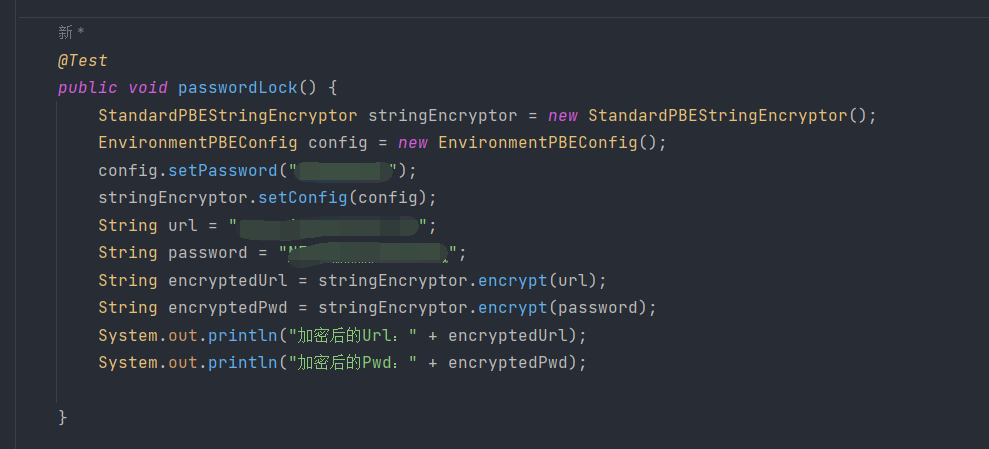
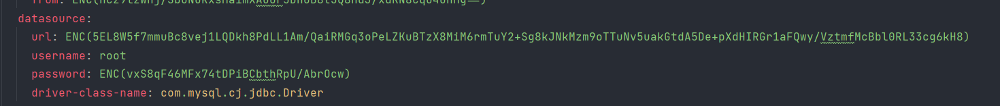
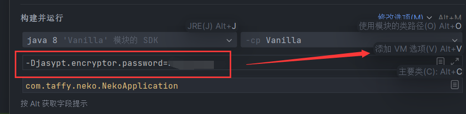

# 智慧校园小程序（开发中）

# 项目介绍
>本项目是基于SpringBoot和Vue的智慧校园系统，用户端采用小程序的形式，管理员端采用Web的形式

# 后端技术栈
1. 核心框架：SpringBoot
2. 安全框架：SpringSecurity
3. ORM框架：Mybatis、Mybatis-Plus、~~Mybatis-Flex~~
4. NoSQL：Redis
5. Markdown 转 HTML：commonmark-java

# 前端技术栈
1. 核心框架：Vue2.x Vue-Router
2. UI框架：Element-UI

# 前端运行
1. cd ./vanilla_front
2. npm install
3. npm run serve

# 后端运行
1. 在本机的数据库运行SQL文件
2. 打开Redis
3. 装好依赖直接运行主类即可

# 关于yml文件敏感数据加密
>本项目整合了jasypt实现了敏感数据脱敏（具体可见yml配置文件）
## 如何加密？
>以下是一个加密的方法，可以自己在单元测试里运行

`config.setPassword()`里是密钥，这个只能你自己设定和知道，随意设置记得住就行，url和password是你的原始数据，接着按照这样就能得到加密后的数据

## 如何使用？
>以下面这段yml配置为例

>将你想加密的敏感数据使用ENC()包围起来，里面放上你刚刚生成的加密数据

## 运行
>加密了之后众所周知需要解密，还记得你刚刚设置的密钥吗?
> 打开运行配置，选择添加VM选项，输入以下代码保存:

`-Djasypt.encryptor.password=******`
> password后面的就是你刚刚设置的密钥，然后点保存并运行，项目会在运行的时候自动用这个密钥去解密，以此保护你的隐私信息~

# License
MIT

# Thanks
秦神

# 功能列表
1. 查看课表
2. 查看成绩
3. 查询空教室
4. 校园导航
5. 学校二手集市
6. 校内贴吧
7. 智慧校园助手（AIGC）
8. ...（拭目以待）